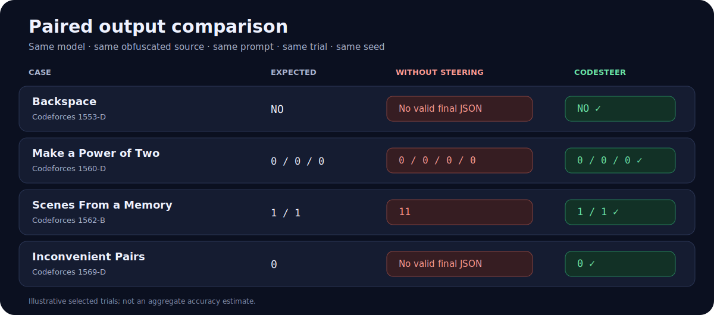

# Representative paired cases

This gallery presents four qualitative long-code output-prediction examples from four distinct DeepMind Code Contests problems. Each comparison uses the same Qwen2.5-14B model snapshot, obfuscated Java source, prompt, trial, and sampling seed. The only experimental difference is whether CodeSteer activation steering is enabled.

> These examples were selected after observing paired outcomes: CodeSteer is exact on the displayed trial and the unsteered condition is not. They illustrate individual behaviors; they are not a random sample and do not estimate aggregate accuracy.

[Open the visual gallery](index.html)

| Case | Expected output | Without steering | With CodeSteer | Evidence |
|---|---|---|---|---|
| [Backspace](01-backspace/) | `NO` | No valid final JSON | `NO` ✓ | [raw pair](01-backspace/#raw-generations) |
| [Make a Power of Two](02-make-a-power-of-two/) | `0\n0\n0` | Four output lines | `0\n0\n0` ✓ | [raw pair](02-make-a-power-of-two/#raw-generations) |
| [Scenes From a Memory](03-scenes-from-a-memory/) | `1\n1` | `11` | `1\n1` ✓ | [raw pair](03-scenes-from-a-memory/#raw-generations) |
| [Inconvenient Pairs](04-inconvenient-pairs/) | `0` | No valid final JSON | `0` ✓ | [raw pair](04-inconvenient-pairs/#raw-generations) |

## What each case contains

- `original.java` and `obfuscated.java`: the paired program variants.
- `input.txt` and `expected_output.txt`: the concrete executable case and oracle.
- `submitted_prompt.txt`: the byte-identical prompt used by both compared conditions.
- `non_steering_raw.txt` and `codesteer_raw.txt`: untouched model completions.
- `*_score.json`: the corresponding machine-generated exact-output scores.
- `metadata.json`: sanitized model, dataset, seed, hash, and selection provenance.

The dataset revision is `deepmind/code_contests@802411c3010cb00d1b05bad57ca77365a3c699d6`. The model snapshot is `Qwen/Qwen2.5-14B@97e1e76335b7017d8f67c08a19d103c0504298c9`.
